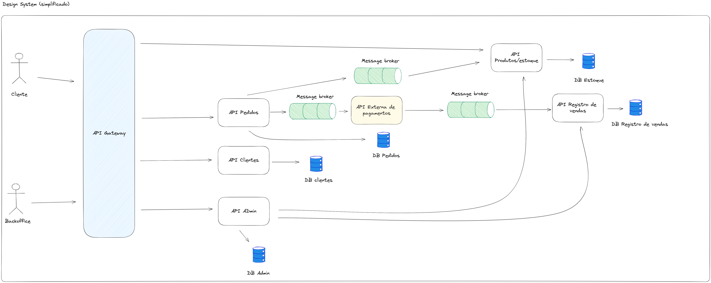

# Projeto Ecommerce Fictício - Aplicação Distribuída com Microsserviços

Este é um projeto para um ecommerce fictício de uma aplicação distribuída baseada na arquitetura de microsserviços 
e na Clean Architecture. Será implementado um pequeno contexto de venda para um ecommerce, com cadastro de clientes, 
produtos, pedidos realizados, backoffice e uma integração com uma API externa de pagamentos (ainda pensando em utilizar 
alguma sandbox de algum sistema gratuito para testes ou desenvolver algo simples para o processamento do pagamento). 

Por fim, o projeto será construído para expor o meu conhecimento em uma aplicação de microsserviços de maneira simples, 
mas irá abordar boas práticas para uma boa comunicação entre as aplicações, que seja resiliente e sem acoplamento.

## Funcionalidades

- Cadastro de clientes
- Cadastro de produtos
- Pedidos realizados
- Backoffice
- Integração com API externa de pagamentos (ainda a definir)

## Tecnologias Utilizadas

- Linguagem de programação: Node.js
- Framework: Nest.js
- Banco de Dados: PostgresSql
- Arquitetura: Arquitetura baseada em microsserviços e Clean Architecture

## Design system atual

